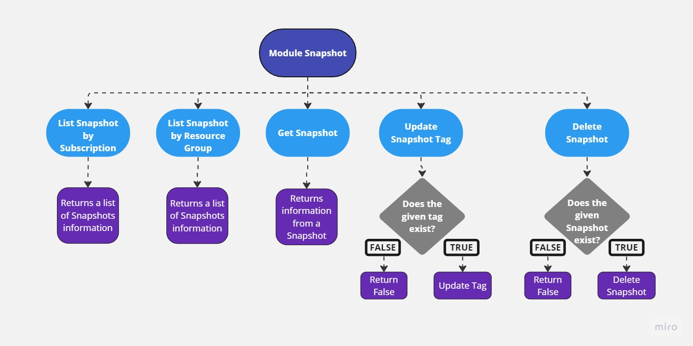

# Module Snapshot 
Module responsible for interacting with Azure Snapshots services and listing snapshots attributes, update snapshot tags and delete a specific snapshot.
#

## **Requirementos**
- [Python 3.10 or higher](https://www.python.org/downloads/)
#

## **Installing Dependencies**
```cmd
poetry install
```

## **Authentication**
This is a Python class called AzureServices that contains methods for managing resources and tags in Azure using the Azure SDK.Additionally,
it uses env variable for get credentials 

- Export variables :
    ```txt
    AZURE_CLIENT_ID="..."
    AZURE_CLIENT_SECRET="..."
    AZURE_TENANT_ID="..."
- Or through **.secrets.toml** file at the your project's root path:
    ```txt
    CLIENT_ID=""
    CLIENT_SECRET=""
    TENANT_ID=""
#

## **Classes**

### *Services*

```python3
class AzureSnapshot()
```

#### Methods:

#### *list_snapshot_by_subscription_id*
```python3
def list_snapshot_by_subscription_id(
    self, 
    subscription_id:str
)
```
List all snapshots existing in one subscription.

**Parameters:**

| Name | Type | Description | Default |
|---|---|---|---|
| subscription_id | str | Unique identifier for an Azure subscription.  | str |
#

#### *list_snapshot_by_resource_group*
```python3
def list_snapshot_by_resource_group(
    self, 
    subscription_id:str,
    resource_group_name:str
)
```
List all snapshots existing in one resource group.

**Parameters:**

| Name | Type | Description | Default |
|---|---|---|---|
| subscription_id | str | Unique identifier for an Azure subscription.  | str |
| resource_group_name | str | Unique identifier for a resource group in Azure.  | str |
#
#### *get_snapshot*
```python3
def get_snapshot(
    self, 
    subscription_id:str,
    resource_group_name:str,
    snapshot_name: str
)
```
Get information for a specific snapshot.

**Parameters:**

| Name | Type | Description | Default |
|---|---|---|---|
| subscription_id | str | Unique identifier for an Azure subscription.  | str |
| resource_group_name | str | Unique identifier for a resource group in Azure.  | str |
| snapshot_name | str | Unique identifier for a snapshot in Azure.  | str |
#
#### *update_snapshot_tag*
```python3
def update_snapshot_tag(
    self, 
    subscription_id:str,
    resource_group_name:str,
    snapshot_name: str,
    tag_key:str, 
    new_tag_value:str
)
```
Updates the value of a tag in a snapshot.

**Parameters:**

| Name | Type | Description | Default |
|---|---|---|---|
| subscription_id | str | Unique identifier for an Azure subscription.  | str |
| resource_group_name | str | Unique identifier for a resource group in Azure.  | str |
| snapshot_name | str | Unique identifier for a snapshot in Azure.  | str |
| tag_key | str | Tag key you want to update.  | str |
| new_tag_value | str | New tag value you want to update.  | str |
#
#### *delete_snapshot*
```python3
def delete_snapshot(
    self, 
    subscription_id:str,
    resource_group_name:str,
    snapshot_name: str
)
```
Delete a specific snapshot.

**Parameters:**

| Name | Type | Description | Default |
|---|---|---|---|
| subscription_id | str | Unique identifier for an Azure subscription.  | str |
| resource_group_name | str | Unique identifier for a resource group in Azure.  | str |
| snapshot_name | str | Unique identifier for a snapshot in Azure.  | str |
#

## **Diagram**
<center>



</center>